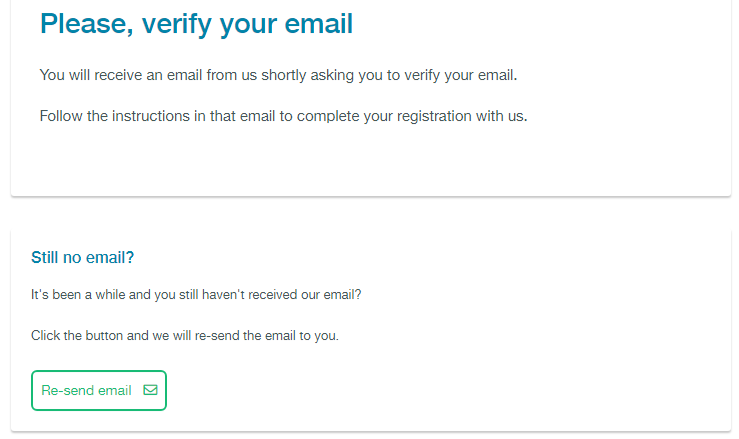
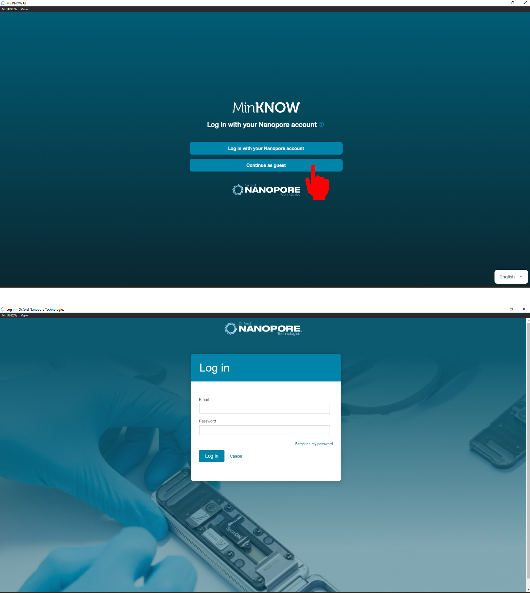
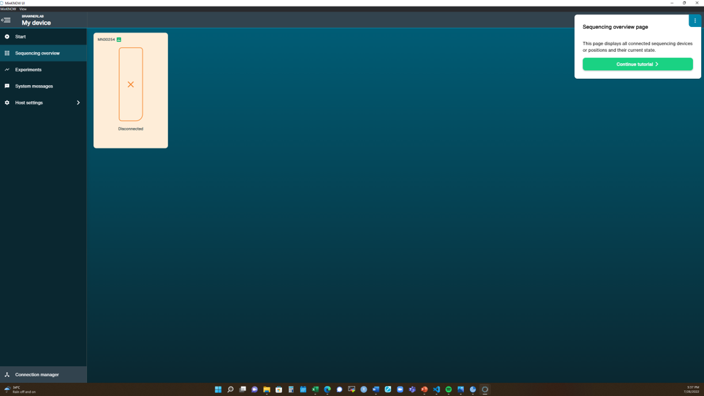

 Setup 
<h2 id="setup">Setup</h2>

  To participate in a this workshop, you will need access to UF Hipergator and the software described below.

  We maintain a list of common issues that occur during installation as a reference for instructors that may be useful on the
  <a href = "{{ site.baseSite }}{{ site.faq }}">FAQ page</a>.

 UF VPN Access 

### Connecting to Gatorlink VPN
Gatorlink VPN is required to access University if Florida Research Computing OnDemand
service, which will provide access to HiperGator cluster.
1. Visit [UF VPN webpage (vpn.ufl.edu)](https://vpn.ufl.edu){: target="_blank"}.
2. Login using the username and password that was emailed to you.
3. In the next page, download **Cisco Anyconnect** software and install it.
4. Once installed, run **Cisco Anyconnect** and click **Connect**.
5. Enter the username and password provided and click **OK**. 
You should now be connected to Gatorlink VPN.

 Hipergator Access 

### Connecting to HiperGator
Make sure you are connected to Gatorlink VPN before the following steps.
1. In you web browser, navigate to [UFRC OnDemand (ood.rc.ufl.edu)](https://ood.rc.ufl.edu/){: target="_blank"}.
2. Login using provided username and password. You will be redirected to UFRC OnDemand homepage.
3. To connect to remote shell, click on **Clusters** in navbar and click 
**Hipergator Shell Access**. Note that the shell will open in new tab.
4. To view and transfer your files, click on **Files** in navbar 
in UFRC OnDemand homepage and click **/blue/general_workshop**.
Double click on directory named as your username to find your files.

 Text editor 


 Nanopore community 

### Join Nanopore Community 
Creating an account for the Nanopore community is required to access the protocols and software dowloads such as MinKNOW, the operating software that drives nanopore sequencing devices. 
Community also provide the online training, and plateform for discussion whithin the community.
1. In your web browser, navigate to [Log in page](shorturl.at/fjBJO){: target="_blank"}. 
2. Click **Register** at the top right corner to register a new account. 

3. Fill in the information that required for creating an account.

4. Sysytem will ask you to provide more detail about you. 

5. Click submit, and then a verification email will be sent to the email you provide at step 3.

6. Find the verification email in your email (could be in the Junk Email), and then **Click To Verify**

7. Please set your password. 

8. You will be redirect to the ONT home page. Click **Community**. If you are not at the ONT home page after password setting, navigate yourself to 
[Community](https://community.nanoporetech.com/). After login, please proceed to **Download MinKnow**. 

 Download MinKNOW 

### Download MinKNOW
Now you can access the Nanopore community, so we need to download MinKNOW, the operating software that drives nanopore sequencing devices.
Also, feel free to explore the community. 
1. Click on **Software Downloads** on the right pannel.

2. You will be direct to *Software Downloads* page. Scroll down to find **MinION Software**(MinKNOW). Please download the software according to your laptop operation system, and
and you can follow the on-screen instructions by clicking **Installation guide** next to the **Download**.

[Note] Please **DO NOT** download MinION Mk1C software. It is a different seqeunce device with touchscreen, which is not used in this workshop. 

3. Click on **MinKNOW icon** on your desktop
4. You will need to log in before start sequecning

5. Once you get in the interface, the system will walk you through the menu.

